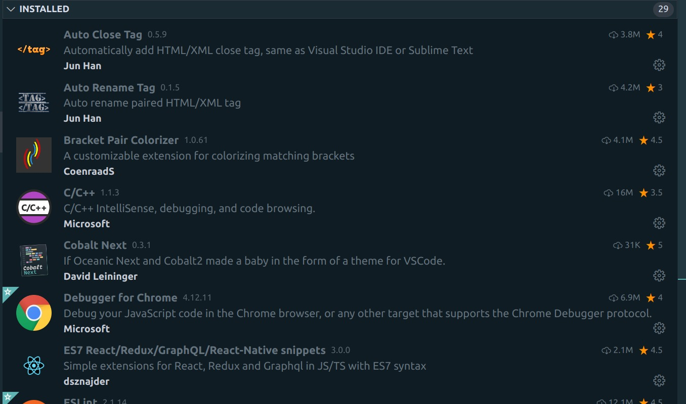
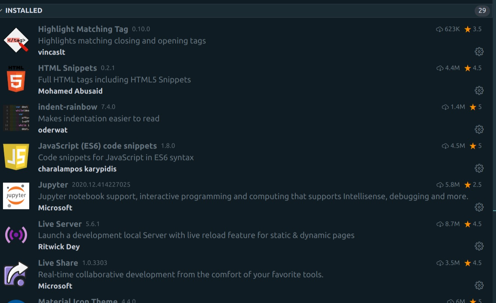
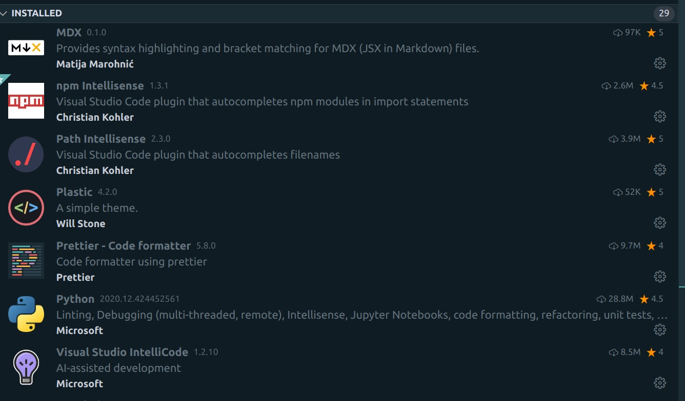

# vscode-setup

## EXTENSIONS



#### _Auto Close Tag_

Auto add HTML/XML close tag

#### _Auto Rename Tag_

Auto rename paired HTML/XML tag

#### _Bracket Pair Colorizer_

A customizable extension for colorizing matching brackets

#### _C/C++_

C/C++ IntelliSense, debugging and code browsing

#### _Debugger For Chrome_

Debug JS code in Chrome Browser.

#### _ES7 React/Redux/GraphQL/React-Native snippets_

Simple extensions for React, Redux and Graphql in JS/TS with ES7 syntax

```javascript
"emmet.includeLanguages": {
    "javascript": "javascriptreact"
  },
```



#### _Highlight Matching Tag_

Highlights matching closing or opening tag

```javascript
"highlight-matching-tag.styles": {
    "opening": {
      "left": {
        "custom": {
          "borderWidth": "0 0 0 3px",
          "borderStyle": "solid",
          "borderColor": "yellow",
          "borderRadius": "5px"
        }
      },
      "right": {
        "custom": {
          "borderWidth": "0 3px 0 0",
          "borderStyle": "solid",
          "borderColor": "yellow",
          "borderRadius": "5px"
        }
      }
    }
  }
```

#### _HTML Snippets_

Full HTML tags including HTML5 Snippets

#### _indent-rainbow_

Makes indentation easier to read

#### _JavaScript (ES6) code Snippets_

Code snippets for JS in ES6 syntax

#### _Live Server_

Launch a development local Server with live reload feature for static & dynamic pages

#### _Live Share_

Real-time collabrative development from the comfort of your favorite tools



#### _MDX_

Provides syntax highlighting and bracket matching for MDX (JSX in Markdown) files

#### _npm Intellisense_

Plugin that autocompletes npm modules in import statements

#### _Path Intellisense_

Plugin that autocompletes filenames

#### _Prettier - Code formatter_

VS Code plugin for prettier/prettier

```javascript
"editor.formatOnPaste": true,
  "editor.formatOnSave": true,
```

#### _vscode-styled-components_

Syntax highlighting for styled-components
